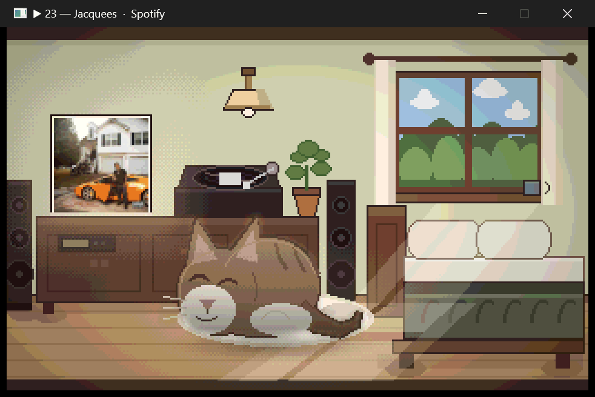
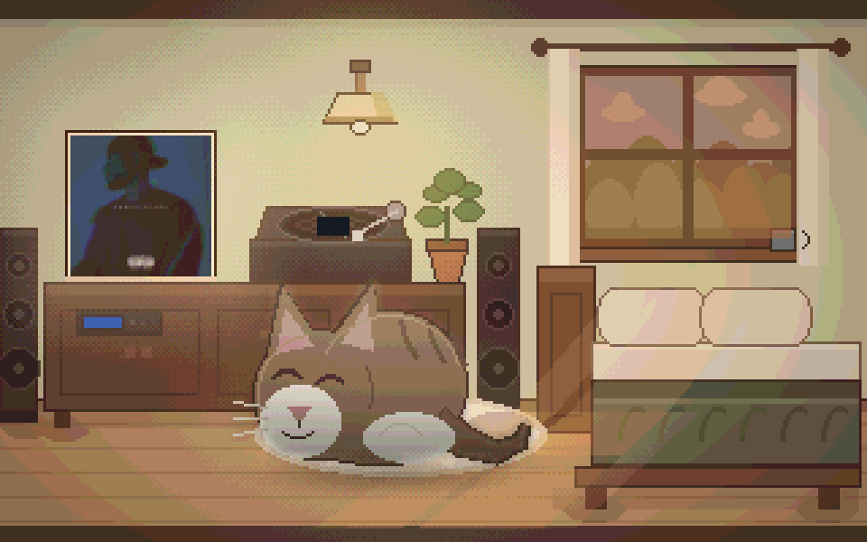
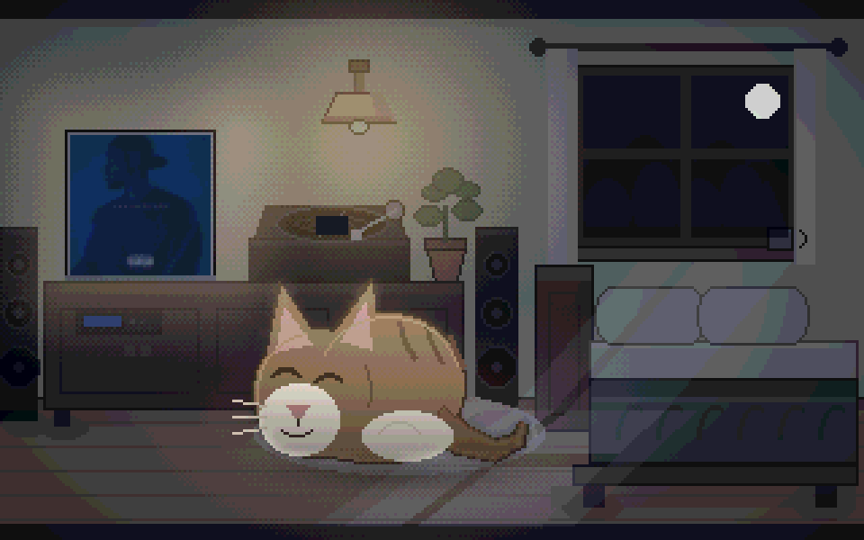
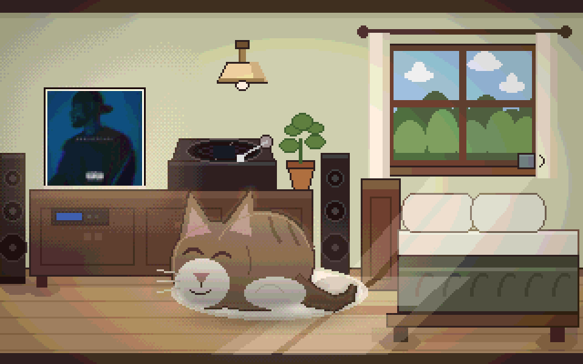
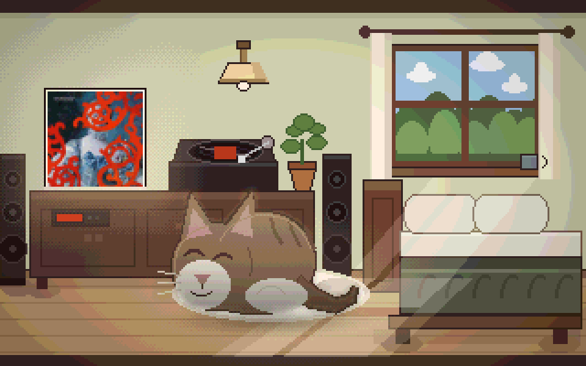
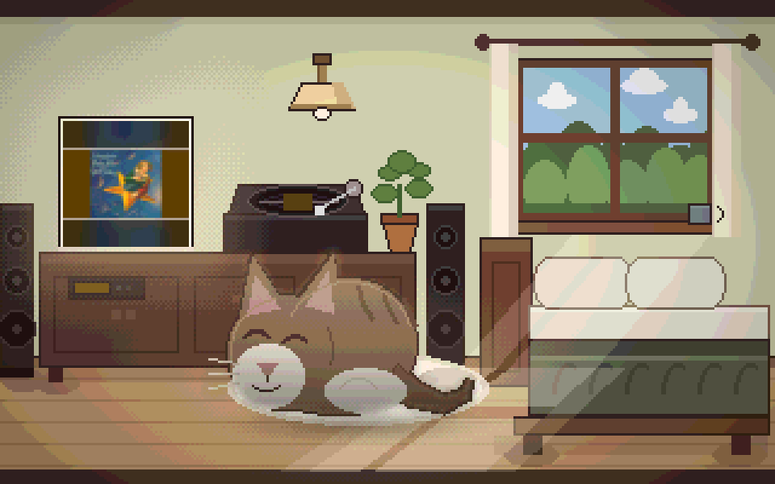

# Bedroom Cat

[](https://github.com/ekelly95/bedroom-cat/actions/workflows/checks.yml)

A small Windows companion that shows an animated pixel-art bedroom reflecting
whatever music is already playing elsewhere on the machine.



Every picture on this page is a capture of the real window, not a render made
for the occasion. The record turns while music plays and coasts to a stop when
it is paused. The cat keeps breathing either way — it runs on its own clock, not
on the music.

It reads Windows' own "now playing" information. It never captures audio, never
analyses sound, never plays music itself, never scans a library, and never talks
to Spotify's servers.

The window is the one thing that follows the real clock rather than playback:

| Day | Evening | Night |
|---|---|---|
|  |  |  |

One album across all three, so the only thing changing there is the light. The
other direction — one hour, three covers — is what the room does with whatever is
playing:

| Spotify, 300 × 300 | foobar2000, 600 × 600 | YouTube in Brave, 150 × 83 |
|---|---|---|
|  |  |  |

Nothing is ever cropped. The widescreen video still on the right is fitted whole
and mounted in bands taken from its own colours, so it reads as a deliberately
framed print rather than a broken render. Each record tints the sleeve, the tiny
label on the turntable and the amp's readout — and nothing else, because
recolouring the room to match the sleeve stops the room being a room.

## Running it

```
uv run bedroom
```

Right-click the room for the size, the source override and the close item.
**F11** fills the screen and Escape comes back out — worth knowing, because the
largest windowed size has to leave room for a title bar and a taskbar, so on a
screen that divides evenly into 320 × 200 fullscreen is the only way to reach
that size at all.

There are three flags:

```
uv run bedroom --demo         # an invented player, for when nothing is playing
uv run bedroom --zoom 3       # 2, 3 or 4 — the size is remembered between runs
uv run bedroom --light night  # pin the hour instead of following the clock
```

## The probe

`probe.py` is the diagnostic that decided whether this project was viable, and it
stays in the repo for when a player stops cooperating.

```
uv run python probe.py          # watch continuously, reprints only on change
uv run python probe.py --once   # single snapshot
```

## What Windows actually reports

Measured on 2026-08-15, Windows 11 26200, with all three players running at once.

| | Spotify desktop | foobar2000 2.25 | YouTube in Brave 151 |
|---|---|---|---|
| **title** | yes | yes | yes, but the raw video title |
| **artist** | yes | yes | usually, sometimes `X - Topic` |
| **album** | yes | **no** | **no** |
| **artwork** | 300×300 PNG | 600×600 JPEG | **150×83 PNG** |
| **position / duration** | yes | **no** — always 0:00 | yes |
| **play** | no | no | no |
| **pause** | yes | yes | yes |
| **next** | yes | yes | **no** |
| **previous** | **no** | yes | **no** |
| **stop** | yes | yes | yes |
| **seek** | yes | **no** | yes |

### What this means for the app

**No single player reports everything, and each one is missing something
different.** The app degrades field by field, never player by player. There is no
"supported players" list in the code — anything that publishes to Windows works,
and each field is used only if it arrives.

Specifically:

- **v0.1 shows no progress indication at all.** foobar2000 publishes no timeline
  whatsoever, so a progress decoration would appear for two players and vanish
  for the third. Behaving identically everywhere is worth more than a decoration
  the room does not need, so it is simply not built rather than conditionally
  hidden. No workaround is attempted.
- **Album is effectively Spotify-only.** It cannot appear anywhere the layout
  depends on it.
- **Artwork varies wildly in shape and size** — from a 150×83 widescreen video
  still to a 600×600 square cover. **Nothing is ever cropped.** Artwork is
  scaled to fit entirely inside the square sleeve, and the leftover bands are
  filled with a colour taken from the artwork itself, so a widescreen video
  still sits in a sleeve that looks deliberate rather than broken.
- **Transport controls must grey out from the live `controls` flags, per player
  and per moment.** They are not fixed per application: Spotify reported
  `previous` as unavailable throughout this session.
- **Several sessions exist routinely, but usually only one is playing.** Spotify
  keeps a session while idle and a browser tab keeps one after the video ends,
  so two or three sessions is the normal state — while the thing actually
  playing is normally unambiguous. The three-way `PLAYING` tie in the table above
  was an artifact of deliberately starting all three at once for the test.

  So the app follows the session Windows itself names as current, which is right
  nearly always. It does **not** use "the first session reporting `PLAYING`" —
  that picks arbitrarily in exactly the case where it matters. The manual
  override is a small item in the right-click menu, listed only when more than
  one session exists, and remembered once chosen. It is an escape hatch, not a
  feature on the face of the room.
- **Spotify keeps publishing when the music is playing on a phone**, mirrored
  over Spotify Connect. The room works for remote playback too.

### Corrections and open questions

- **foobar2000 was expected to publish nothing** — corrected. Its components
  folder contains only the nine that ship with it, and SMTC support has
  historically needed a separate plugin. It publishes fine regardless, and gives
  the best artwork of the three. No plugin needed.
- **Why Spotify reports no `previous` is still open.** It was unavailable in
  every snapshot taken here, but playback was being mirrored from a phone over
  Spotify Connect and it was not confirmed whether it ever ran locally on the
  desktop during the test. So "Spotify never supports previous" is not
  established — only that it did not during this session. It makes no difference
  to the app, which greys the button from the live flag either way.

## How Windows moves the "current session" marker

Measured 2026-08-15 by switching deliberately between all three players while
polling twice a second.

| Observed | Behaviour |
|---|---|
| A **new** session appears and starts playing | It takes the marker immediately, even though another session is still playing |
| The current session **pauses** while another is playing | The marker hands off to the one still playing |
| The current session pauses and **nothing** is playing | The marker stays put |
| The track changes within the current session | The marker stays put |
| An **existing paused** session is resumed while the current one is still playing | **The marker does not move** |

Detection latency was well under a second throughout.

**This makes Windows' current session a good default.** It follows what you
started, hands off sensibly when you pause, and does not flicker to an empty
room. It also rules out "the first session reporting `PLAYING`": when Brave
started while Spotify was already playing, enumeration order would have kept
Spotify, and Windows correctly moved to Brave.

**Its one stale case** is the last row: with foobar2000 playing and a paused
Brave tab resumed, the marker stayed on foobar2000 and the room would keep
showing it. That only arises when two players are genuinely playing at once,
which is not a normal state — and it is exactly what the manual override in the
right-click menu is for. No cleverer default is worth building: a rule that
chased the most recent play would let a background tab autoplaying an ad steal
the room, which is a worse failure than a stale marker during an abnormal one.

## Development

```
uv run pytest
uv run ruff check .
uv run python tools/make_assets.py      # rebuild the art, and its own proofs
```

Every picture in this README is captured from the running window, and none of
them is written by the bake. That separation is deliberate: `make_assets.py`
composites the room through a second copy of the app's pipeline, the two copies
drifted apart once already, and a proof made by the copy is not proof of what
ships. The captures are `window-*.png`; the bake's own renders are `room-*.png`
and are development aids, nothing more.

```
.\tools\capture_window.ps1              # one still, whole window
.\tools\capture_window.ps1 -Room        # the room alone, no title bar
.\tools\capture_window.ps1 -Seconds 15  # a GIF of the room actually running
```

`--light` pins the time of day, which is how the day, evening and night pictures
above were taken one after another instead of eight hours apart.
